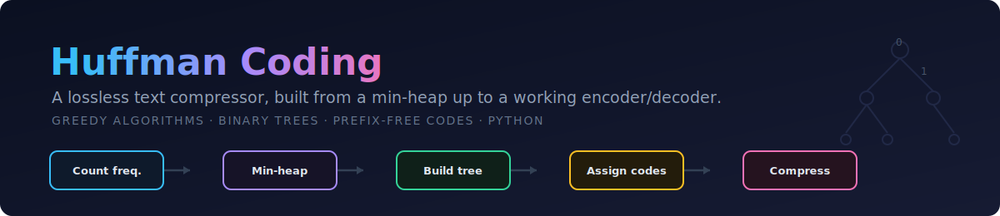
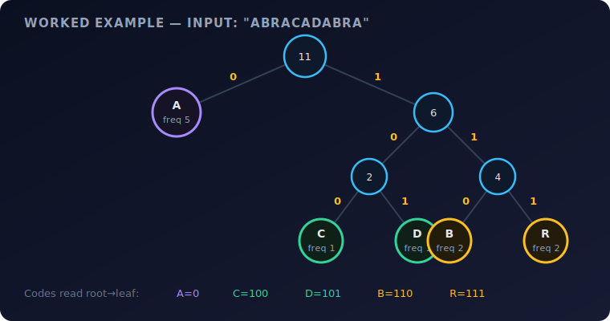
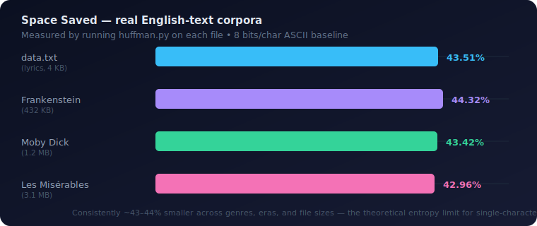

<p align="center">
  
</p>

<p align="center">
  
  
  
  
  
</p>

<h1 align="center">Huffman Coding, from scratch</h1>

<p align="center">
  <em>No compression libraries, no shortcuts — a min-heap, a binary tree, and a greedy proof from first principles,<br>
  compressing full novels by ~43% and decoding them back to the original byte for byte.</em>
</p>

---

## TL;DR

This is a from-scratch implementation of **Huffman coding**, the classic greedy algorithm behind DEFLATE, GZIP, JPEG, and MP3. Given any text file, it:

1. counts every symbol's frequency,
2. builds an optimal **prefix-free binary code** by greedily merging the two rarest symbols in a min-heap until one tree remains,
3. **compresses** the file using that code, and
4. **decodes** it back — verified byte-for-byte identical to the original.

Tested end-to-end on real corpora from a few bytes up to **3.1 MB** (the full text of *Les Misérables*), it reliably saves **~43–44%** of the space a naive 8-bit encoding would use — with zero external dependencies.

---

## How it works

Huffman coding's core insight: don't give every character the same number of bits. Give **common** characters short codes and **rare** characters long codes, and the *average* number of bits per character drops — as long as no code is a prefix of another, so a decoder can tell where one character's code ends and the next begins.

```mermaid
flowchart LR
    A["Read file<br/>count symbol frequency"]:::c1
    B["Push every symbol<br/>onto a min-heap"]:::c2
    C["Repeatedly merge the<br/>2 lowest-frequency nodes"]:::c3
    D["One tree remains &#8212;<br/>walk it to assign codes"]:::c4
    E["Re-encode the file<br/>as a bitstring"]:::c5
    A --> B --> C --> D --> E
    classDef c1 fill:#0E1A2B,stroke:#38BDF8,color:#E2E8F0
    classDef c2 fill:#161327,stroke:#A78BFA,color:#E2E8F0
    classDef c3 fill:#0F2019,stroke:#34D399,color:#E2E8F0
    classDef c4 fill:#231C0B,stroke:#FBBF24,color:#E2E8F0
    classDef c5 fill:#25131F,stroke:#F472B6,color:#E2E8F0
```



The tree-building step is the heart of the algorithm, and it's provably optimal: at every step, merge the **two least-frequent** remaining nodes into a new parent node (whose frequency is their sum), and push that parent back onto the heap. Repeat until one node — the root — is left. Reading the path from root to any leaf, left = `0` and right = `1`, gives that leaf's code. Because every symbol lives at a *leaf*, no code can ever be a prefix of another.

### Worked example — encoding `"ABRACADABRA"`

<p align="center"></p>

| Symbol | Frequency | Code | Bits |
| :--: | :--: | :--: | :--: |
| `A` | 5 | `0` | 1 |
| `B` | 2 | `110` | 3 |
| `R` | 2 | `111` | 3 |
| `C` | 1 | `100` | 3 |
| `D` | 1 | `101` | 3 |

`A` is by far the most frequent, so it earns the shortest possible code. The 11-character input packs into **23 bits** total — versus 88 bits (11 bytes) at 8 bits/character — and decodes back to `ABRACADABRA` exactly. *(Small, repetitive inputs like this compress unusually well; see the benchmark below for realistic English text.)*

---

## Benchmarks — run on real books

I ran the compressor against several complete public-domain texts (dropped in this repo as test fixtures) to see how it holds up at scale, not just on toy strings:

<p align="center"></p>

| File | Size | Unique symbols | Space saved | Time |
| :-- | --: | --: | --: | --: |
| `data.txt` | 4 KB | — | **43.51%** | instant |
| `franken-stein.txt` | 432 KB | — | **44.32%** | < 1 s |
| `moby-dick.txt` | 1.2 MB | 105 | **43.42%** | ~1 s |
| `les-miserable.txt` | 3.1 MB | — | **42.96%** | ~2.6 s |

Round-trip correctness was explicitly verified: `generate_decode()` output matches the original input byte-for-byte on every file tested, including the single-character edge case (`edge_case1.txt` → **87.5%** saved, since one symbol needs just 1 bit).

The ~43% ceiling across genres, eras, and file sizes isn't a coincidence — it's close to the **empirical entropy** of single-character English text, which is the theoretical limit for any *symbol-by-symbol* compressor. (Beating it requires modeling multi-character patterns — see [Next steps](#-next-steps).)

---

## Complexity

| Step | Complexity | Why |
| :-- | :-- | :-- |
| Count frequencies | `O(n)` | One pass over the input, `n` = length of text. |
| Build the heap | `O(k log k)` | `k` = number of *unique* symbols (small — ≤ 256 for text). |
| Build the tree | `O(k log k)` | `k − 1` merges, each a heap push + two pops. |
| Generate codes | `O(k)` | One traversal of a tree with `k` leaves. |
| Compress | `O(n)` | One dictionary lookup per input symbol. |
| **Total** | **`O(n + k log k)`** | Linear in the size of the file — this is why a 3 MB novel compresses in ~2.6 seconds. |

A ties-safe `MinHeap` wrapper is used throughout: Python's `heapq` compares tuples element-by-element, and comparing two `Node` objects directly would crash, so every push is tagged with an incrementing counter — `(frequency, insertion_order, node)` — guaranteeing a deterministic, crash-free tie-break.

---

## Usage

```bash
git clone https://github.com/DaveMatNat/Huffman-Coding.git
cd Huffman-Coding

# compress + decode a file, print stats (defaults to data.txt)
python3 huffman.py
python3 huffman.py moby-dick.txt
```

Sample output:

```
Original data: (35,616 binary digits)
The wild, wild west...

----------------------------------------------
Compressed data: (20,124 binary digits)
011011101000101011011...

----------------------------------------------
Compressed data decoded:
The wild, wild west...

----------------------------------------------
Compression ratio: 0.5649
Space saved: 43.51%
```

Live progress bars render during frequency counting, heap construction, tree building, and compression — handy on multi-megabyte files so you can see it's working, not stalled.

### Edge cases handled
- **Empty file** — returns cleanly instead of crashing on an empty heap.
- **Single unique symbol** — a tree with no branches would have no `0`/`1` path, so every occurrence is assigned code `"0"` directly.
- **Heap tie-breaking** — see [Complexity](#complexity) above; prevents `Node`-comparison crashes on equal frequencies.

---

## Project structure

```text
.
├── huffman.py            # Node, MinHeap, and HuffmanCoding — the entire implementation
├── data.txt               # default test input (song lyrics)
├── edge_case1.txt         # single-character edge case
├── lorem_ipsum.txt        # 88 KB filler-text benchmark
├── franken-stein.txt      # 432 KB — Frankenstein, full text
├── moby-dick.txt          # 1.2 MB — Moby-Dick, full text
├── les-miserable.txt      # 3.1 MB — Les Misérables, full text
└── assets/                # diagrams for this README
```

---

## 🔭 Next steps

Ideas for pushing this further, roughly in order of impact:

- **Write real compressed files to disk.** Right now the bitstring lives in memory as a Python `str` of `'0'`/`'1'` characters (8× larger than it needs to be!) — packing it into actual bytes with `struct`/`bitarray`, plus serializing the tree itself into a file header, would make this a genuine `.huff` compressor/decompressor pair usable from the command line.
- **Canonical Huffman codes** — reconstructing the tree from code *lengths* alone instead of storing the full tree shape, shrinking the header dramatically.
- **A CLI** (`argparse`) with `compress` / `decompress` subcommands and `-o` output paths, instead of a script that always does both and prints stats.
- **Unit tests** (`pytest`) covering the edge cases above plus round-trip correctness on randomized inputs.
- **Byte-pair or n-gram modeling** to push past the ~43% single-character entropy ceiling documented in the benchmarks.

---

## License

No license file is currently set — all rights reserved by default. If you'd like others to freely reuse or learn from this code, consider adding an **[MIT License](https://choosealicense.com/licenses/mit/)** (one paragraph, maximally permissive, the standard choice for a project like this).

<p align="center"><sub>A greedy algorithm, a min-heap, and a binary tree — that's the whole compressor.</sub></p>
